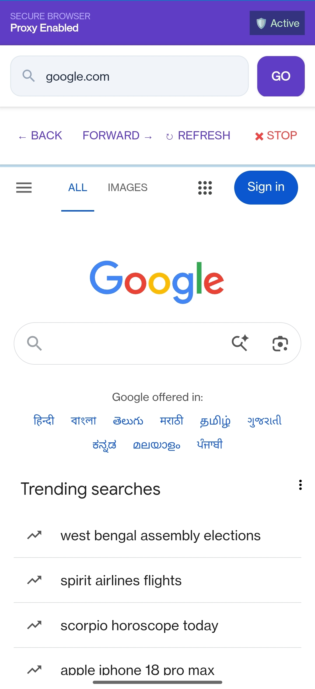
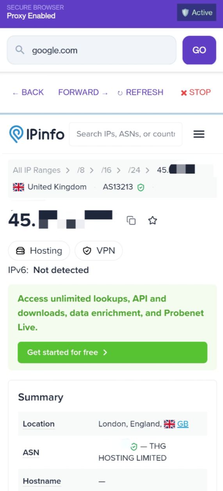

# 🔒 Secure Proxy Browser


**An Android browser that automatically fetches and applies proxy credentials from a remote server. No manual configuration. Zero settings. Just browse.**

---

## 📱 Screenshots

| Home Screen | Proxy Working |
|-------------|---------------|
|  |  |

---

## ✨ Features

| Feature | Description |
|---------|-------------|
| 🚀 Auto Proxy Fetch | Gets live IP, port, username, password from server automatically |
| 🔐 Seamless Authentication | Handles HTTP proxy auth without annoying popups |
| 🧹 Session Isolation | Clean cookies and cache for each new session |
| ⚡ One-Tap Browsing | Just enter URL and press Go |
| 🎨 Modern UI | Clean, premium design with navigation controls |
| 🔄 Back/Forward/Refresh | Full browser navigation buttons |
| 📊 Progress Bar | See page loading progress |
| 🛡️ Proxy Status | Live indicator showing proxy connection status |

---

## 🛠️ Tech Stack

| Technology | Purpose |
|------------|---------|
| Java | Core programming language |
| Android SDK | Mobile application framework |
| WebView | Browser rendering engine |
| NetCipher | Proxy binding library |
| REST API | Server communication |
| JSON | Data exchange format |

---

## 🔧 How It Works

**Step 1:** App Starts
**Step 2:** Fetches proxy from server (IP, Port, User, Pass)
**Step 3:** NetCipher binds WebView to the proxy
**Step 4:** User enters URL → Traffic routes through proxy
**Step 5:** Browse securely & anonymously

---

## 📦 Download Source Code

**Direct Download:** Click on `Secure-Proxy-Browser-(src).zip` from the files above and extract.

**Clone Repository:**
```bash
git clone https://github.com/iamDineshChavan/Secure-Proxy-Browser.git
```

---

🔑 Server Setup

Create a PHP endpoint proxy.php:

```php
<?php
header('Content-Type: application/json');

$response = [
    'proxy1_ip' => 'your ip',
    'proxy1_port' => 'port',
    'proxy1_user' => 'your_username',
    'proxy1_pass' => 'your_password'
];

echo json_encode($response);
?>
```

Sample Response:

```json
{
  "proxy1_ip": "ip",
  "proxy1_port": "port",
  "proxy1_user": "username",
  "proxy1_pass": "password"
}
```

---

📱 How to Use

1. Install the app
2. App fetches proxy automatically on startup
3. Enter URL in search bar
4. Press "Go" button
5. Use Back/Forward/Refresh buttons
6. Visit ipinfo.io to verify proxy IP

---

👨‍💻 Author

iamDineshChavan

GitHub: https://github.com/iamDineshChavan

---

⭐ Show Support

Star this repo: https://github.com/iamDineshChavan/Secure-Proxy-Browser

---

Built with Java | Simple, secure, proxy-enabled browsing for everyone

```
